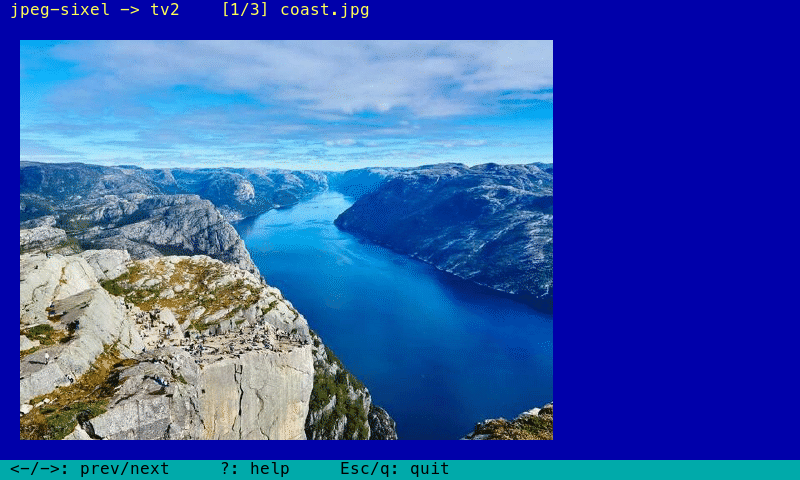

# tvision-sixel

Display a JPEG as real **sixel** graphics inside a
[`tv2`](../tvision/tv2) view — the CLOS-native Turbo Vision kernel — using the
[`jpeg-sixel`](../jpeg-sixel) encoder to do the decode → quantize → sixel step.



<sub>Composited from the program's real output — the actual decoded sixel picture
at its real cell position, with tv2's title/status chrome in the real theme
colors (yellow-on-blue title, black-on-cyan status).</sub>

## Run

```lisp
(asdf:load-system "tvision-sixel")
(tvision-sixel:demo)                       ; gallery: coast / nature / flower
(tvision-sixel:run)                        ; a single image (the coast photo)
(tvision-sixel:run "media/flower.jpg")     ; or any baseline JPEG
```

You need a **sixel-capable terminal** (iTerm2, foot, WezTerm, mlterm,
`xterm -ti vt340`, recent VTE). Check with `jpeg-sixel:sixel-supported-p`.

Keys:

| Key | Action |
| --- | --- |
| `←` `→`, `Space`, `n` / `p` | previous / next image (gallery) |
| `?`, `F1` | toggle the help overlay |
| `r` | redraw / re-emit the sixel |
| `Esc`, `q` | quit |

## Standalone executable

```sh
make bin            # dumps ./tvision-sixel-demo (SBCL image, samples baked in)
./tvision-sixel-demo               # runs the gallery
./tvision-sixel-demo some.jpg …    # or show your own baseline JPEGs
```

`build.lisp` bakes the bundled JPEGs into the saved image (`*embedded-images*`)
and dumps an executable whose toplevel is `tvision-sixel:main`. At startup the
embedded bytes are written to a temp dir, so the binary is **self-contained** —
it needs neither the source tree nor the media files. Pass file paths as
arguments to show your own images instead.

## How it works

tv2 renders into a character-cell back buffer and flushes only the cells that
changed. Sixels aren't cells — they're a raw escape sequence the terminal paints
at the cursor's pixel position — so `image-view` lives in both worlds:

1. **As a tv2 view** it draws its chrome (title bar, hint line, a cleared image
   area) into the cell buffer via the normal `draw`/`fill-row`/`draw-text`
   helpers.
2. **The picture** is written straight to the terminal *after* `flush-screen`,
   positioned at the image area's top-left cell and wrapped in `ESC 7`/`ESC 8`
   (DECSC/DECRC, save/restore cursor) so it never disturbs the cursor or scroll
   state tv2 tracks.

Because `flush-screen` only rewrites *changed* cells, the cleared image area is
only written on frames where it actually changes; the sixel painted on top
therefore survives until the next redraw, at which point the loop re-emits it.

The image is scaled to the view's pixel size: `prepare-sixel` reads the view's
cell bounds, multiplies by the terminal's pixel cell size (probed once via
`jpeg-sixel:query-cell-size`, falling back to 10×20), and asks `jpeg-sixel` to
fit the picture into that box (aspect-preserving, never upscaling).

Key pieces, all in `src/tvision-sixel.lisp`:

| Symbol | Role |
| --- | --- |
| `image-view` | a `tv2:view` subclass (`reactive-class`) holding the cached sixel + geometry |
| `prepare-sixel` | size the image area and encode the JPEG to a fitted sixel string |
| `draw` (method) | paint the cell chrome; leave the image area blank |
| `emit-overlay` | write the sixel to `screen-out` at the image origin, DECSC/DECRC-wrapped (skipped while help is up) |
| `draw-help` | a centered, framed keybinding panel drawn in cells; painting cells over the image erases the sixel underneath |
| `run` / `demo` | the tv2 event loop (via `run-gallery`), plus one line to emit the overlay after each flush |
| `main` | executable toplevel: materializes the embedded samples (or takes file args) and runs the gallery |

## Dependencies & loading

`tvision-sixel` depends on `tv2` (→ `tvision`) and `jpeg-sixel`, all sibling
projects under `~/Projects/common-lisp/`. They resolve automatically through the
global ASDF `:tree` source registry — no ocicl entry is needed for the local
systems; `tv2` pulls its own third-party deps from `tvision/systems/`.

## Tests

```lisp
(asdf:test-system "tvision-sixel")
```

The suite is **headless** (no tty): it builds the view, sizes it, generates a
real sixel from the bundled JPEG, and checks that `draw`/`emit-overlay` are
safe when there is no screen. The interactive loop needs a real sixel terminal
and is not driven there.

## Notes

- Bundled samples are **baseline** JPEGs — cl-jpeg (as pinned via ocicl) cannot
  decode progressive JPEGs. Convert with `magick in.jpg -interlace none out.jpg`.
- This is a demo of the `tv2` + `jpeg-sixel` seam, not a general image widget
  (single static image, full-screen, no scrolling/zoom).

## License

MIT
